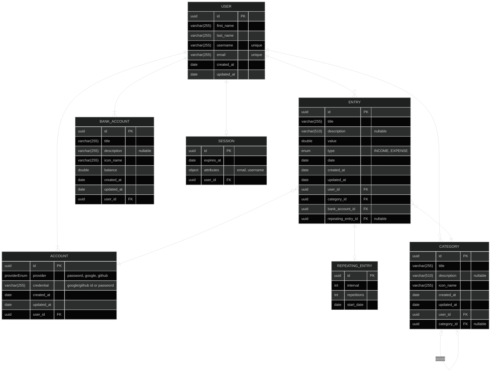

# Entity Relationship Diagram

```mermaid
erDiagram
%%{init: {'theme':'dark'}}%%

    USER {
        uuid id PK
        varchar(255) first_name
        varchar(255) last_name
        varchar(255) username "unique"
        varchar(255) email "unique"
        date created_at
        date updated_at
    }

    ACCOUNT {
        uuid id PK
        providerEnum provider "password, google, github"
        varchar(255) credential "google/github id or password"
        date created_at
        date updated_at

        uuid user_id FK
    }


    ENTRY {
        uuid id PK
        varchar(255) title
        varchar(510) description "nullable"
        double value
        enum type "INCOME, EXPENSE"
        date date
        date created_at
        date updated_at

        uuid user_id FK
        uuid category_id FK
        uuid bank_account_id FK
        uuid repeating_entry_id FK "nullable"
    }

    %% replaces "subscriptions" in UI
    REPEATING_ENTRY {
        uuid id PK
        %% number of days between ocurrences
        int interval
        %% how many times should it repeat, forever if null
        int repetitions
        date start_date
    }

    CATEGORY {
        uuid id PK
        varchar(255) title
        varchar(510) description "nullable"
        varchar(255) icon_name
        date created_at
        date updated_at

        uuid user_id FK
        %% allows for nested categories
        uuid category_id FK "nullable"
    }

    BANK_ACCOUNT {
        uuid id PK
        varchar(255) title
        varchar(255) description "nullable"
        varchar(255) icon_name
        double balance
        date created_at
        date updated_at

        uuid user_id FK
    }

    %% stored in redis for speed purposes
    SESSION {
        uuid id PK
        date expires_at
        object attributes "email, username"

        uuid user_id FK
    }


    USER 1 to 0+ ENTRY : ""
    USER 1 to one or zero SESSION : ""
    USER 1 to 0+ CATEGORY : ""
    USER 1 to 1+ BANK_ACCOUNT : ""
    USER 1 to 1+ ACCOUNT : ""

    CATEGORY one or zero to one or zero CATEGORY : "nested"

    ENTRY 0+ to 1 CATEGORY : ""
    ENTRY 0+ to 1 ACCOUNT : ""
    ENTRY 1 to one or zero REPEATING_ENTRY : ""
```
